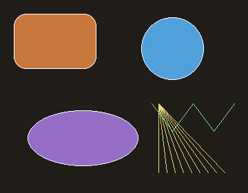
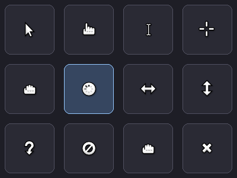

# wayland (FPC)

A Free Pascal Wayland protocol binding, plus the code generator that produces it.

This is a **direct wire-protocol binding**: it speaks the Wayland protocol itself
over the compositor socket and does **not** link `libwayland` (no
`libwayland-client`, no `libwayland-cursor`). Marshalling, the event/object
dispatch, fd passing, the shm pool and the cursor-theme (XCursor) loader are all
implemented in pure Pascal on top of the FPC RTL — the only runtime dependency is
a running Wayland compositor.

## Screenshots

From the [examples](wayland-examples/README.md):

| | |
|---|---|
|  |  |
| `wl_window_demo` — a basic toplevel | `canvas_demo` — `TWaylandCanvas` shapes |
|  |  |
| `canvas_dmabuf` — canvas in a CPU dma-buf | `cursor_demo` — cursor grid, retargets the pointer on hover |
|  | |
| `themed_window` — client-side title bar from the desktop theme, rounded (alpha) corners, working buttons + right-click window menu | |

<sub>Images live in [`docs/screenshots/`](docs/screenshots/).</sub>

## Layout

The project is split by dependency footprint so the runtime binding stays free
of heavy build-time dependencies:

The library modules are grouped under a `wayland-client/` pom and a
`wayland-server/` pom, both over a shared `wayland-common/` transport.

| Directory | What | Dependencies | Built with |
|---|---|---|---|
| `wayland-common/` | Shared, direction-agnostic transport: the Unix-socket + fd plumbing, the wire codec, the object base (`TWaylandBase` + message dispatch), event-message/fd-stream types, and the xkbcommon bindings. Not built standalone; each `*-rt` compiles it in via a `../../wayland-common` unit path. | FPC RTL only | (compiled into each `*-rt`) |
| `wayland-client/rt/` | Client runtime: generated `wayland.pas` (core protocol proxies) + the RTL-only utilities `wayland_canvas` ([docs](docs/wayland-canvas.md)) and `wayland_dmabuf`. | `wayland-common` (unit path) | **pasbuild** |
| `wayland-client/stable/` | Stable wayland-protocols, generated as `<protocol>_protocol` units (xdg-shell, linux-dmabuf, viewporter, …). | `wayland-client/rt` | **pasbuild** |
| `wayland-client/unstable/` | Unstable (`z*`) wayland-protocols. | rt, stable | **pasbuild** |
| `wayland-client/staging/` | Staging (`ext_`/`wp_` v1) wayland-protocols. | rt, stable, unstable | **pasbuild** |
| [`wayland-client/classes/`](wayland-client/classes/README.md) | Higher-level OOP convenience layer (library): a display/event loop, windows, double-buffered surfaces (shm or dma-buf), a software canvas, cursors and clipboard/drag-and-drop. ([API docs](docs/wayland-classes/index.md).) | rt + protocol tiers | **pasbuild** |
| `wayland-server/rt/` | Server runtime base (`wayland_server_core`): `TWaylandServerResource` (a server-side protocol object, requests routed to `message` handlers), `TWaylandServerClient` (per-connection object map + server-range id allocation + receive loop), `TWaylandServerDisplay` (listening socket + accept/poll loop). The generated server protocol tiers will build on this once the generator grows a server mode. | `wayland-common` (unit path) | **pasbuild** |
| `wayland-demo/` | Demo / dogfood app that connects to a live compositor. | client rt + stable + staging | **pasbuild** |
| [`wayland-examples/`](wayland-examples/README.md) | Standalone example programs, one executable each (window, canvas, dma-buf, cursor grid, clipboard, themed CSD window). Not built by default. | client rt + tiers + classes | **fpc** (`make examples`) |
| [`wayland-gen/`](wayland-gen/README.md) | Code generator: reads Wayland protocol XML, emits the binding units. Bundles a vendored AST writer in `wayland-gen/vendor/`. | FPC RTL only | **pasbuild** |

The module **names** are unchanged (`wayland-rt`, `wayland-stable`, …,
`wayland-classes`) — only their directories moved under `wayland-client/`.

Every protocol unit is named `<protocol>_protocol` (e.g. `xdg_shell_protocol`,
`linux_dmabuf_v1_protocol`); the core `wayland` unit keeps its bare name as it is
integrated with the runtime. Class names drop the leading `z` of unstable
interfaces (`zwp_linux_dmabuf_v1` → `TWpLinuxDmabufV1`). The generator resolves
cross-protocol references automatically and emits the needed `uses` clause.

The generator is RTL-only: its Pascal-source AST writer was vendored into
`wayland-gen/vendor/` (re-based off the RTL) so it no longer depends on tiOPF or
`json_easy`, and builds with pasbuild like the rest. It is registered in the
aggregator as `activeByDefault="false"` (a build-time tool), so a plain
`pasbuild compile` skips it.

## Build

Runtime library and demo (no tiOPF needed):

```sh
pasbuild compile            # builds rt -> stable -> unstable -> staging -> classes -> demo
pasbuild compile -m wayland-rt
```

Or via the `Makefile`, which prefers `pasbuild` and falls back to invoking `fpc`
directly (compiling dependency units from source) when it is not on `PATH`:

```sh
make                        # runtime libraries + demo
make examples               # the standalone example programs (one exe each)
make clean
```

`make examples` builds every `wayland-examples/src/main/pascal/*.pas` into
`wayland-examples/target/`.

Code generator (an `activeByDefault="false"` module, so build it explicitly):

```sh
pasbuild compile -m wayland-gen   # builds wayland-gen/vendor then wayland-gen
```

## Regenerating the bindings

`regen_units <outdir> <protocol.xml> [<protocol.xml> ...]` pre-scans every given
XML (plus the core `wayland.xml`) to build the interface→unit map, then writes
`<outdir>/<protocol>_protocol.pas` for each. The core protocol:

```sh
pasbuild compile -m wayland-gen
./wayland-gen/target/regen_units wayland-client/rt/src/main/pascal /usr/share/wayland/wayland.xml
```

All extension protocols (stable/unstable/staging) are regenerated together so
cross-protocol references resolve, then split into their tier package by source
directory — see `scripts/regen-all.sh`.

The reader rejects non-protocol XML (it validates the root element is
`<protocol>`). `docs/wayland_fpc-fpdoc.xml` is FPDoc documentation, **not**
protocol input.

## Licensing

This project's own code (the runtime, the OOP classes layer, the generator, the
demo and examples) is **BSD-3-Clause** — see [`LICENSE`](LICENSE). Every source
file carries an SPDX header; the generator re-emits it into each generated unit.

The generated protocol bindings (`wayland.pas` and the `*_protocol.pas` units)
are derived from the upstream `wayland` / `wayland-protocols` XML, which is
**MIT (Expat)** licensed by its respective authors. Their attribution and the
MIT permission notice are reproduced in
[`THIRD-PARTY-NOTICES.txt`](THIRD-PARTY-NOTICES.txt). MIT and BSD-3-Clause are
compatible permissive licenses.
